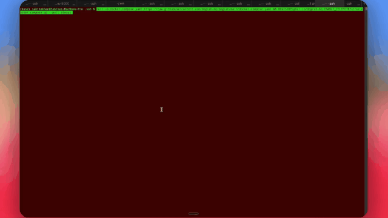
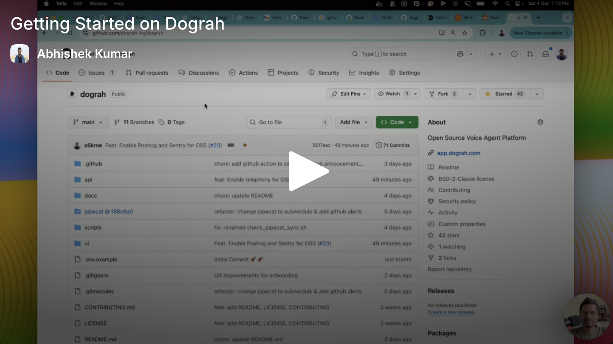

# Dograh AI

> 💡 **Notice**: This documentation is community-maintained. If you spot any translation inaccuracies or content that has drifted from the English version, please feel free to open a PR!
>
> 💡 **注記**: このドキュメントはコミュニティによって保守されています。翻訳の不正確さや英語版からの内容のずれを見つけた場合は、ぜひ PR を作成してください。

**オープンソースでセルフホスト可能な Vapi / Retell の代替手段** -- ドラッグ&ドロップのワークフロービルダーで本番向け音声エージェントを構築できます。ゼロから 2 分以内で動作するボットを立ち上げられます。

<p align="center">
  <a href="https://app.dograh.com">
    
  </a>
  &nbsp;
  <a href="#-クイックスタート">
    
  </a>
  &nbsp;
  <a href="https://join.slack.com/t/dograh-community/shared_invite/zt-3zjb5vwvl-j7hRz3_F1SOn5cH~jm5f5g">
    
  </a>
</p>

<p align="center">
  <a href="https://docs.dograh.com">📖 ドキュメント</a> &nbsp;·&nbsp;
  <a href="LICENSE">📜 BSD 2-Clause</a> &nbsp;·&nbsp;
  <a href="README.md">🌐 English</a> &nbsp;·&nbsp;
  <a href="README.zh-CN.md">🌐 中文</a>
</p>

<p align="center">
  
</p>

- **100% オープンソース**でセルフホスト可能 -- Vapi や Retell と違い、ベンダーロックインはありません
- **完全な制御と透明性** -- すべてのコードが公開され、LLM / TTS / STT の統合も柔軟に差し替えられます
- **YC 卒業生と事業売却を経験した創業者が保守**し、音声 AI をオープンに保つことに取り組んでいます

<p align="center">
  <a href="https://trendshift.io/repositories/31007" target="_blank"></a>
</p>

## 🎥 メディア掲載

<div align="center">
  <a href="https://www.youtube.com/watch?v=xD9JEvfCH9k">
    
  </a>
  <br>
  <em><strong>Better Stack</strong> による実践レビュー -- Dograh を詳しく紹介</em>
</div>

<details>
<summary>📺 2 分のプロダクト紹介動画を見たい場合はこちら。</summary>

<div align="center">
  <a href="https://youtu.be/9gPneyf9M9w">
    
  </a>
</div>

</details>

## ⚖️ Dograh vs Vapi vs Retell

音声 AI プラットフォームを評価しているチームに向けて、重要な観点を率直に比較します。

|  | **Dograh** | **Vapi** | **Retell** |
|---|---|---|---|
| **ライセンス** | BSD 2-Clause (オープンソース) | プロプライエタリ | プロプライエタリ |
| **セルフホスト** | ✅ 可能 -- Docker コマンド 1 つ | ❌ SaaS のみ | ❌ SaaS のみ |
| **料金** | 無料(セルフホスト)・従量課金(クラウド) | 分単位課金の SaaS | 分単位課金の SaaS |
| **独自 LLM / STT / TTS の利用** | ✅ 任意のプロバイダー、または Dograh 標準スタック | 提供範囲内で設定可能 | 提供範囲内で設定可能 |
| **ソースコードレベルのカスタマイズ** | ✅ すべてのコードを自由に変更可能 | ❌ クローズドソース | ❌ クローズドソース |
| **データレジデンシー** | 自社インフラ、自社ルール | ベンダーのクラウド | ベンダーのクラウド |
| **ベンダーロックイン** | なし | あり | あり |


## 🚀 クイックスタート

##### ローカルマシンに Dograh をダウンロードしてセットアップ

> **注記**
> 製品改善のため、匿名の利用状況データを収集します。無効にするには、起動スクリプトを実行する前に `ENABLE_TELEMETRY=false` を設定してください。

> **注記**
> リモートサーバーでプラットフォームを実行したい場合は、[ドキュメント](https://docs.dograh.com/deployment/docker#option-2:-remote-server-deployment)を参照してください。

```bash
curl -o docker-compose.yaml https://raw.githubusercontent.com/dograh-hq/dograh/main/docker-compose.yaml && curl -o start_docker.sh https://raw.githubusercontent.com/dograh-hq/dograh/main/scripts/start_docker.sh && chmod +x start_docker.sh && ./start_docker.sh
```

> **⚡ AI エージェントにセットアップを任せたいですか?**
> **Claude Code** または **Codex** を使っている場合は、公式の [Dograh セットアップ skill](https://github.com/dograh-hq/dograh-plugins) をインストールすると、インストール、設定、トラブルシューティングをエージェントに任せられます。OS を検出し、適切なデプロイ方法を選び、Dograh 付属のセットアップスクリプトを実行して結果を検証します。
>
> ```text
> # Claude Code の場合
> /plugin marketplace add dograh-hq/dograh-plugins
> /plugin install dograh@dograh
> ```
>
> その後、新しいセッションを開始して _"set up Dograh"_ と依頼するか、`/dograh-setup` を実行してください。Codex も対応しています。詳しくは[プラグインリポジトリ](https://github.com/dograh-hq/dograh-plugins#install)を参照してください。

> **注記**
> 初回起動では、すべてのイメージをダウンロードするため 2-3 分かかる場合があります。起動後、http://localhost:3010 を開くと最初の AI 音声アシスタントを作成できます。
> よくある問題と解決策は 🔧 **[トラブルシューティング](docs/getting-started/troubleshooting.mdx)** を参照してください。

### 🎙️ 最初の音声ボット

1. ブラウザで [http://localhost:3010](http://localhost:3010) を開きます。
2. **Inbound(着信)** または **Outbound(発信)** を選び、ボットに名前を付けます(例: _リード判定_)。続けて用途を 5-10 語で説明します(例: _保険フォーム送信者の購入意向を確認_)。
3. **Web Call** をクリックすると、ボットと直接会話できます。

> 🔑 **API キーは不要です。** Dograh には自動生成されるキーと、組み込みの LLM / TTS / STT スタックが付属しています。必要に応じて、独自の LLM、TTS、STT、または Twilio、Vonage、Telnyx などの電話連携プロバイダーをいつでも接続できます。

## 機能

### 音声機能

- 電話連携: Twilio、Vonage、Vobiz、Cloudonix などを標準搭載(他のプロバイダーも簡単に追加可能)。有人オペレーターへの転送にも対応
- 言語: 英語をサポート(他言語へ拡張可能)
- カスタムモデル: 独自の TTS / STT モデルを持ち込み可能
- リアルタイム処理: 低遅延の音声インタラクション

### 開発者体験

- ゼロ設定で開始: API キーを自動生成し、すぐにテスト可能
- Python ベース: Python で構築されており、カスタマイズしやすい
- Docker ファースト: コンテナ化により一貫したデプロイが可能
- モジュラー構成: 必要に応じて各コンポーネントを差し替え可能

### テストと品質

- **テストモード**: 本番通話や本番データに影響を与えず、公開前にエージェントをエンドツーエンドで試せます
- **ダッシュボード内 Web 通話**: 電話連携を設定しなくても、構築中にボットと直接会話できます
- **QA ノード**: 他のノードに含まれるプロンプト品質を分析する組み込みワークフローノード

## デプロイ方法

### ローカル開発

[ローカルセットアップ](https://docs.dograh.com/contribution/setup)を参照してください。

### セルフホストデプロイ

リモートサーバーへのデプロイや HTTPS 設定を含む詳しい手順は、[Docker デプロイガイド](https://docs.dograh.com/deployment/docker)を参照してください。

### クラウド版

マネージドクラウド版は [https://www.dograh.com](https://www.dograh.com/) から利用できます。

## 📚 ドキュメント

完全なドキュメントは [https://docs.dograh.com](https://docs.dograh.com/) を参照してください。

## 📦 SDKs

- **Python SDK** -- [pypi.org/project/dograh-sdk](https://pypi.org/project/dograh-sdk/)
- **Node SDK** -- [npmjs.com/package/@dograh/sdk](https://www.npmjs.com/package/@dograh/sdk)

## 🤝 コミュニティとサポート

> 👋 **Better Stack の動画から来ましたか?** [固定された GitHub Discussion](https://github.com/orgs/dograh-hq/discussions/291) にユースケースを投稿してください。すべての返信を確認し、創業チームが初期ユーザーを直接オンボーディングします。

- **Slack** -- Dograh AI のコラボレーションの中心です。メンテナーとつながり、実装前に機能を相談し、セットアップの支援を受け、コントリビューション活動の最新情報を追えます。
- **GitHub Discussions** -- ユースケースを共有し、質問し、ワークフローのレシピを交換できます。
- **GitHub Issues** -- バグ報告や機能リクエストに利用してください。

👉 参加はこちら → [Dograh Community Slack](https://join.slack.com/t/dograh-community/shared_invite/zt-3zjb5vwvl-j7hRz3_F1SOn5cH~jm5f5g)

## 🙌 コントリビューション

コントリビューションを歓迎します。Dograh AI は 100% オープンソースであり、今後もそうあり続けます。

### はじめに

- このリポジトリを Fork する
- 機能ブランチを作成する(`git checkout -b feature/AmazingFeature`)
- 変更をコミットする(`git commit -m 'Add some AmazingFeature'`)
- ブランチへプッシュする(`git push origin feature/AmazingFeature`)
- Pull Request を作成する

## ⭐ Star 履歴

<a href="https://star-history.com/#dograh-hq/dograh&Date">
  
</a>

## 📄 ライセンス

Dograh AI は [BSD 2-Clause License](LICENSE) のもとで公開されています。Dograh AI の構築に使われたプロジェクトと同じライセンスであり、互換性と、利用・変更・配布の自由を確保しています。

## 🏢 私たちについて

**Dograh** (Zansat Technologies Private Limited) が ❤️ を込めて開発しています。
創業チームは YC 卒業生と事業売却を経験した創業者で構成され、音声 AI をオープンで誰もが利用できるものに保つことに取り組んでいます。

<br><br><br>

  <p align="center">
    <a href="https://github.com/dograh-hq/dograh/stargazers">⭐ GitHub で Star する</a> |
    <a href="https://app.dograh.com">☁️ クラウド版を試す</a> |
    <a href="https://join.slack.com/t/dograh-community/shared_invite/zt-3zjb5vwvl-j7hRz3_F1SOn5cH~jm5f5g">💬 Slack に参加</a>
  </p>
